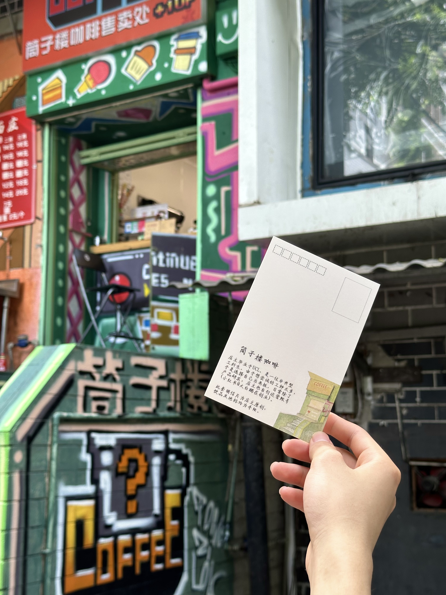
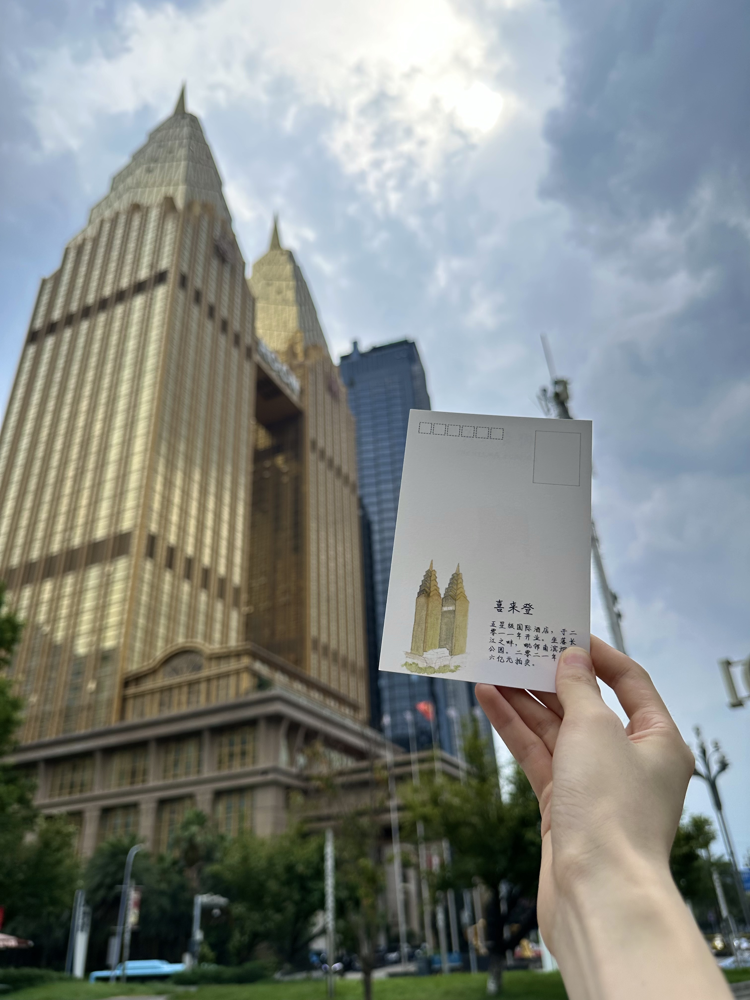
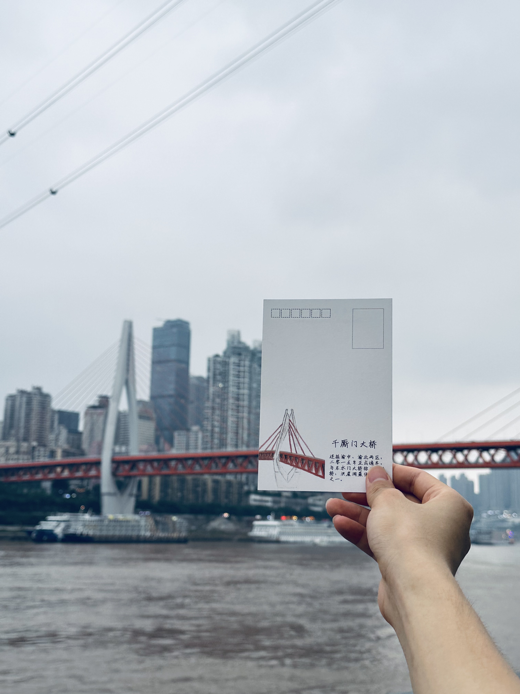
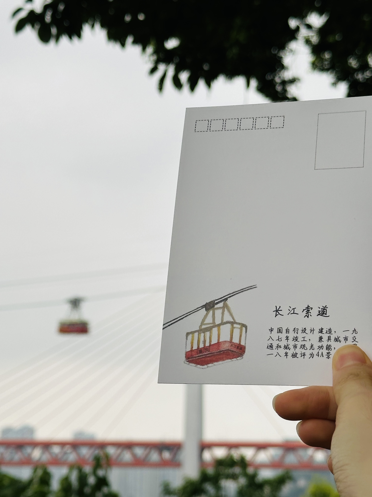
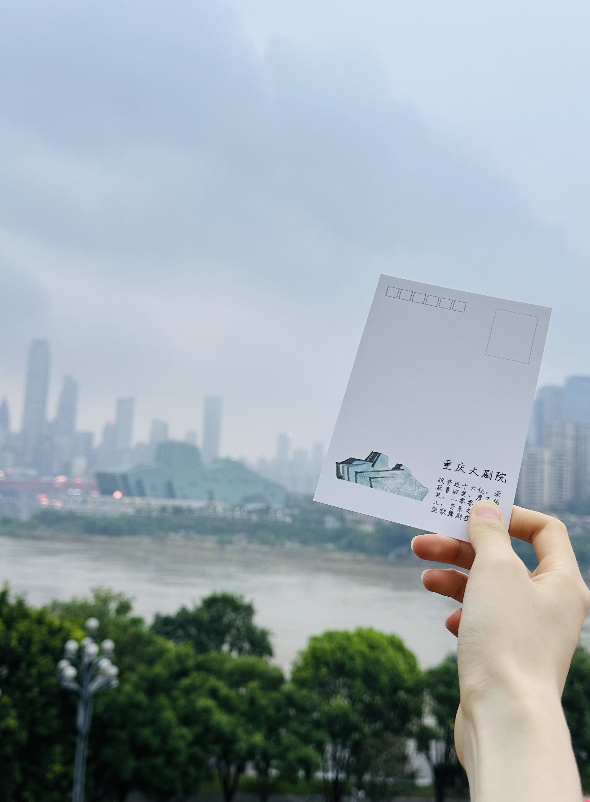

This is a set of postcards that I personally designed and hand-illustrated. The front side features signature drinks from my coffee shop, while the back highlights iconic landmarks from my hometown, Chongqing.

### Front Side of the Postcard

### Back Side of the Postcard

