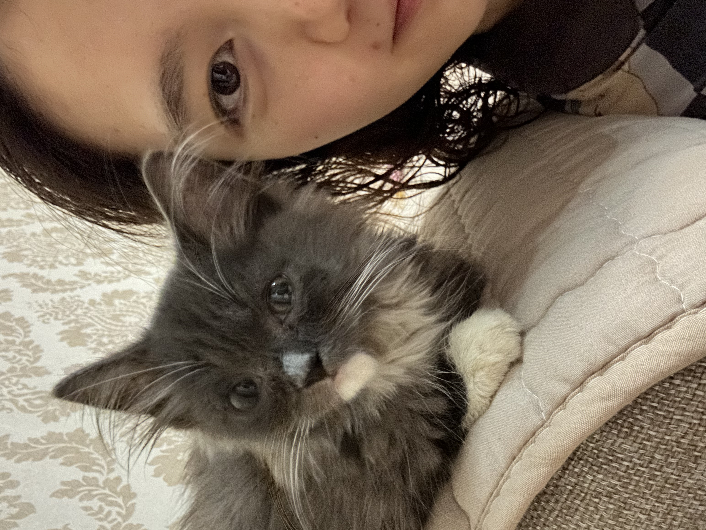

[Chinese version](https://www.xiaohongshu.com/explore/67846ac9000000001703c381?xsec_token=ABW8RK2eyLtd03UXjPaVE7d7T-05z_fG7Aec-rX3AqZ5g=&xsec_source=pc_user)

<!--more-->

I almost cried the moment the plane touched down, not out of “excitement” from returning home after three months, but out of relief that the journey went smoothly. Just before my trip back, there were four aviation accidents within a single week, one of which happened in the Netherlands. That was when I finally understood why Western passengers cheer and applaud 👏🏻 when a plane lands safely.

Before my vacation, I found a little kitten. She was only about two months old, skinny from hunger, and meowing at me in her tiny baby voice. She looked so pitiful that I brought her home despite my mom’s objections. During these three months, she actually got along quite well with my mom. She’s clever, alerting my mom when water starts boiling in the pot. She’s also naughty, dragging her cat food under the sofa to sneak snacks.

A few days ago, she wasn’t behaving well. While my parents were at work, she pooped all over the house 💩. They said it was due to separation anxiety. Maybe that’s true. After all, humans experience separation anxiety too.

Back to work now. If you want to come drink coffee and share stories, I’m waiting for you at the usual place.