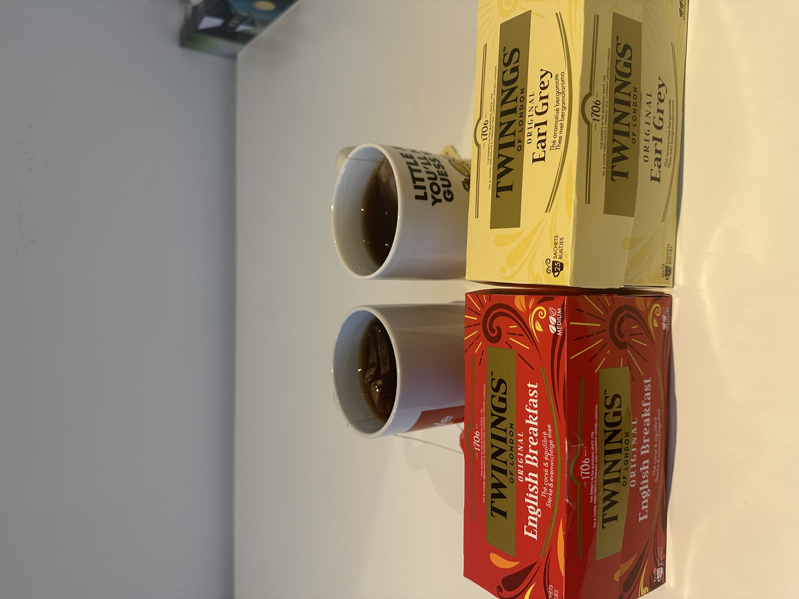

### Recipe

1 orange + 1 apple + a handful of goji berries + 30g brown sugar + 4g back tea + 1200ml Water

[Chinese version](https://www.xiaohongshu.com/explore/67908a53000000001800fc61?source=webshare&xhsshare=pc_web&xsec_token=ABFwfrEXJ2RsmEeQGi8S69h3lfmlD_bLDbNpA_7YvSZr0=&xsec_source=pc_share)

<!--more-->

### Review

#### Brewing Methods

Method 1
Stir-fry the tea leaves for 2 minutes → add white sugar and heat until caramelized → add a few slices of fresh orange → add water and bring to a boil.

Method 2
Steep black tea for 3 minutes → mix the tea with freshly squeezed orange juice at a 4:1 ratio → add sugar according to taste.

Method 3
Put all ingredients except the tea leaves (orange, apple, etc.) into the pot and bring to a boil → add the tea leaves and simmer for 3 minutes.

#### BEvaluation of the Brewing Methods
Method 1
This is a common approach in many online posts, but it’s the one I least recommend.
    1.Stir-frying the tea leaves is very tricky—if the heat is even slightly off, the drink can become burnt, bitter, or overly astringent.
    2.Also, because you can't use high heat, the entire process becomes very time-consuming.
If you must use Method 1, please note:
⚠️ Always use low heat | Do not stir the sugar | Turn off heat and strain immediately after boiling.

Method 2
This was my “lazy backup” solution after failing with Method 1, but it turned out surprisingly good.
I compared Twinings Earl Grey and English Breakfast. Earl Grey is slightly more astringent, and with orange juice added, the drink becomes more sour.

Method 3
This is the improved version of Method 1.
By boiling the fruits first, you release the fruit aroma before adding the tea, so you don’t have to worry about burning the sugar or the tea leaves. You can cook the whole thing over high heat, which saves a lot of time.
Compared with Method 2, this version has a richer, fresher fruit aroma—and it’s more cost-effective.

### Additional Tips
1. You can skip the apple 🍎, but I highly recommend adding one. It adds depth and a stronger fruit fragrance. With the apple included, you can reduce the amount of sugar.
2. If your final drink tastes bitter or overly astringent, it may be because the tea steeped for too long, or because the orange wasn’t peeled (the white pith turns bitter when boiled).
