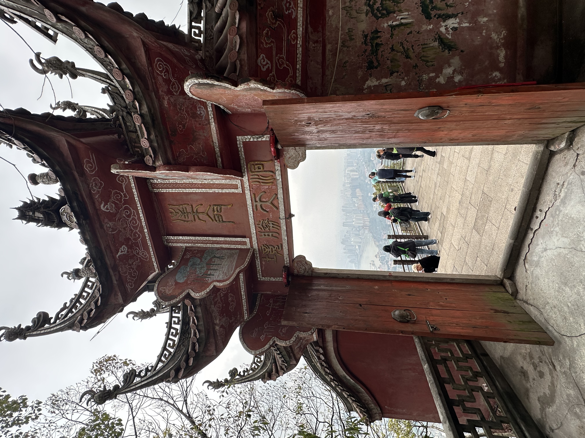

[Chinese version](https://www.xiaohongshu.com/explore/67e8aec000000000090155a4?xsec_token=ABaUKAi3O2hTRkiPXaCmDSl2s_TJaBBD6vUhnldttiZDs=&xsec_source=pc_user)

<!--more-->

During the days without updates, I was still quietly living and feeling life.

Ever since I opened the shop last year and started this account, I’ve kept a steady posting rhythm. I didn’t update daily like some people suggested, but I also never disappeared for more than seven days, because I treat this account as part of my work. Even though it doesn’t bring me any income, I still take it seriously.

At the beginning, I set a goal for myself: 500 followers in two years.
It wasn’t really about the number. It was about hoping for some positive feedback.
Fortunately, I was blessed by the algorithm, and I reached my two-year target in just the first month.

My friend said I’m doing quite well, both with the shop and with the account.
I said maybe it’s because every drink is something I test cup by cup, and every caption is something I write word by word. Nothing is done perfunctorily.

I didn’t update for ten days because I was sick. I had one draft prepared, but I wasn’t satisfied with it. So I just let myself lie down and rest, do nothing until I recovered.

And just like that… I somehow made it to the 11-month anniversary of my little shop.
