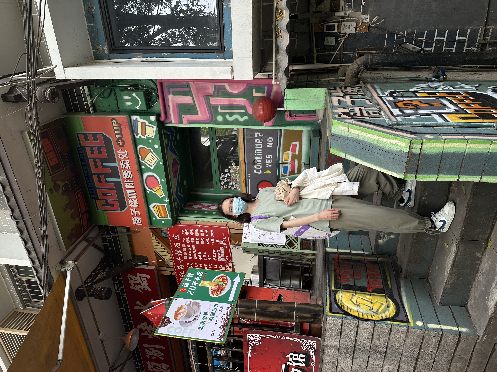

[Chinese version](https://www.xiaohongshu.com/explore/6811949c0000000009038f0a?xsec_token=AB1WcyixoMtGAh9Oiu0qX6kAYpsmAZEbdeHTXBNktQy_Y=&xsec_source=pc_user)

From decision to completion, the handover of the shop took only a week. If I hadn’t been hospitalized, it might have been even faster.

When I signed the contract and completed the deregistration, I didn’t feel much.
Until one day, I opened my drafts and saw an unfinished “1/2 Plan Check-in” post，and suddenly, it hit me.
There will never be TZL Coffee again.

After signing the contract, I grabbed my things and left. I even forgot to take a photo with the shop.
After finishing at the tax office, I went back specially and asked the lady from the next-door shop to help me take a picture. I didn’t expect it to look good，just wanted a memory.

This past year was full of stories. I even planned to stay for another three years.

But I don’t feel qualified to “romanticize” this lifestyle, because I haven’t achieved success in the conventional sense.

2024.4.30 – 2025.4.30
This journey has come to an end.

I’m moving forward without feeling down.

